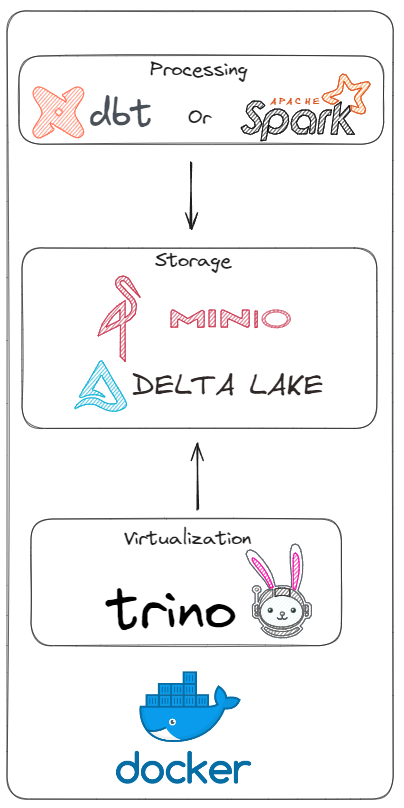

# Playground Data Processing

## Arquitetura


## Pré-requisitos
- Docker

## Como instalar os pré-requisitos?
- Docker 
 
Playlist WSL + Docker: 
https://www.youtube.com/watch?v=pRFzDVn40rw&list=PLbPvnlmz6e_L_3Zw_fGtMcMY0eAOZnN-H

## Subir serviços

### Postgres Adventureworks
```
cd postgres_adventureworks
sudo docker compose up -d 
```

### Data exploration                    
```
sudo docker compose up -d trino
sudo docker compose up -d spark-master
```

### Storage                             
```
sudo docker compose up -d minio  
```

# How access?

### Postgres Adventureworks
```
  - Username: postgres
  - Password: postgres
```

### Minio: http://localhost:9001
```
  - Username: chapolin
  - Password: mudar@123
```

### Trino: http://localhost:8080
```
  - Username: trino
```

### Jupyter: http://localhost:8889
### Spark: http://localhost:4040 (just spark execution)

## Como executar o dbt?
O dbt está rodando em um container, então basta fazer o build da imagem dento da pasta ```src/dbt```. Vale lembrar que você pode instalar também o dbt core e utilizar fora de um container.

```
docker build -t dbt-processing .
```

depois execute o container:
```
docker run -it --rm dbt-processing
```

## Como executar um job spark?
```
spark-submit \
  --master spark://spark-master:7077 \
  --num-executors 10 \
  --executor-memory 2G \
  --executor-cores 2 \
  example.py
```

## Deploy no modo Swarm
Crie um cluster para que faça sentido usar o modo Swarm. Você pode utilizar o Playground do Docker, mas neste cenário eu utilizei um cluster na GCP. Para criar um cluster na GCP, eu já deixei um repositório ensinando o passo a passo. 

https://github.com/wlcamargo/cluster-gcp


Faça deploy da Stack do cluster Spark com o comando abaixo. 

```
docker stack deploy -c docker-compose-swarm.yml cluster_spark
```

### Get Token Jupyter
```
docker exec -it <id do container jupyter> /bin/bash
```

```
jupyter notebook list
```

### Aplicação para testar o Spark rodando em cluster
```
from datetime import datetime, date, timedelta
from pyspark.sql import SparkSession, Row
import random

# Iniciar a sessão Spark
spark = SparkSession.builder \
    .appName('generate-fake-data') \
    .master('spark://spark-master:7077') \
    .getOrCreate()

def generate_row(index):
    return Row(
        a=index,
        b=random.uniform(1.0, 10.0),
        c=f'string{index}',
        d=date(2000, 1, 1) + timedelta(days=index % 365),
        e=datetime(2000, 1, 1, 12, 0) + timedelta(days=index % 365, hours=index % 24)
    )

rows = [generate_row(i) for i in range(1, 10000000)]

df = spark.createDataFrame(rows)

df.show()
```

## Developer
| Desenvolvedor      | LinkedIn                                   | Email                        | Portfólio                              |
|--------------------|--------------------------------------------|------------------------------|----------------------------------------|
| Wallace Camargo    | [LinkedIn](https://www.linkedin.com/in/wallace-camargo-35b615171/) | wallacecpdg@gmail.com        | [Portfólio](https://wlcamargo.github.io/)   |
